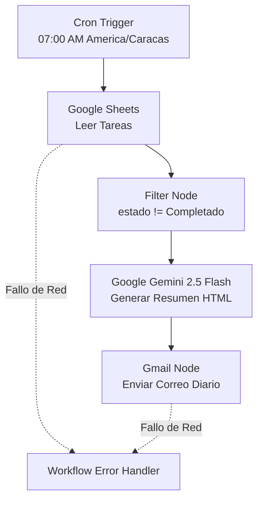

# Task Notifier – Automatización de Resumen Diario con n8n, Gemini y Gmail

Este repositorio contiene un flujo de trabajo (workflow) robusto y de nivel de producción desarrollado en **n8n** para la automatización, procesamiento inteligente y despacho por correo electrónico de tus tareas pendientes diarias.

El sistema extrae tareas desde una hoja de cálculo en **Google Sheets**, las agrupa y analiza utilizando el modelo **Gemini 2.5 Flash** de Google para estructurar un resumen ejecutivo HTML semántico (con código de colores por prioridad), y envía la notificación final a través de la API de **Gmail**.

---

## 📖 Arquitectura del Sistema

El workflow está diseñado de forma modular y tolerante a fallos:

---

## ⚙️ Especificaciones de la Base de Datos (Google Sheets)

Para la persistencia y lectura de tareas, se utiliza un archivo en Google Drive:

* **Nombre del Archivo:** `Gestion_Tareas_Productividad`
* **Nombre de la Hoja:** `Tareas_Pendientes`
* **Esquema de Columnas (Cabeceras):**
  `id` (Entero), `titulo` (Texto), `descripcion` (Texto), `fecha_limite` (Fecha YYYY-MM-DD), `prioridad` (Alta, Media, Baja), `estado` (Pendiente, En Progreso, Completado), `categoria` (Ámbito de la tarea).

### Dataset de Ejemplo

| id | titulo | descripcion | fecha_limite | prioridad | estado | categoria |
|---|---|---|---|---|---|---|
| 1 | Calificar Evaluaciones Computación | Revisar y asentar notas en la plataforma de la UNEXPO. | 2026-07-09 | Alta | Pendiente | UNEXPO |
| 2 | Grabar Sección 4 de Curso Python | Producir y editar 3 nuevos videos para Udemy. | 2026-07-10 | Media | En Progreso | Udemy |
| 3 | Revisar Pipeline de Automatización | Optimizar manejo de excepciones en scripts locales. | 2026-07-12 | Baja | Pendiente | Personal |

---

## 🚀 Requisitos y Configuración de Credenciales

El workflow utiliza las abstracciones de credenciales nativas de n8n para mayor seguridad. Necesitarás tener creadas las siguientes credenciales en tu instancia:

| Servicio | Tipo de Credencial en n8n | Uso |
|---|---|---|
| **Google Sheets** | `googleSheetsOAuth2Api` | Lectura de tareas pendientes |
| **Google Gemini** | `googlePalmApi` | Orquestación de Inteligencia Artificial |
| **Gmail** | `gmailOAuth2` | Despacho de notificaciones HTML |

---

## 💻 Instalación y Despliegue

1. **Importar el Flujo de Trabajo:**
   * Abre tu instancia de n8n.
   * Crea un nuevo workflow.
   * Ve al menú de opciones (tres puntos arriba a la derecha) y selecciona **Import from File**.
   * Elige el archivo [workflows/task_notifier_workflow.json](workflows/task_notifier_workflow.json) de este repositorio.

2. **Configuración Manual:**
   * En el nodo **Obtener Tareas Google Sheets**, selecciona tu credencial de Google Sheets y asegúrate de que el `documentId` corresponda al ID de tu archivo `Gestion_Tareas_Productividad`.
   * En el nodo **Enviar Correo Diario**, selecciona tu credencial de Gmail y define la dirección de correo destinatario.
   * En el nodo **Generar Resumen Gemini**, selecciona tu credencial de Gemini (cuenta PaLM API) y asegúrate de que esté seleccionado el modelo `models/gemini-2.5-flash`.

3. **Manejo de Errores (Error Handler):**
   * El workflow principal está diseñado para redirigir fallos al workflow secundario de control `Task Notifier — Error Handler`.
   * Ve a **Workflow Settings** (Ajustes de flujo) en la interfaz de n8n y en la sección **Error Workflow** selecciona el flujo de manejo de errores correspondiente.

4. **Activación:**
   * Realiza un test haciendo clic en **Execute workflow**.
   * Si recibes el resumen con éxito, activa el interruptor **Active** para habilitar la ejecución diaria a las 07:00 AM (Zona Horaria `America/Caracas`).

---

## 🧪 Pruebas y Evaluación de la IA (Testing & Evaluation Dataset)

Para garantizar la confiabilidad y consistencia del nodo de Inteligencia Artificial (Gemini 2.5 Flash), se ha diseñado una metodología de pruebas utilizando un **Dataset de Evaluación** siguiendo las guías recomendadas por n8n.

La estructura y los escenarios de prueba detallados se encuentran en el archivo [tests/evaluation_dataset.csv](tests/evaluation_dataset.csv).

### Estructura de la Hoja de Evaluación

| Columna | Tipo | Descripción |
|---|---|---|
| **`id`** | Texto | Identificador único de la prueba (ej: `test-001`). |
| **`scenario_name`** | Texto | Nombre descriptivo del escenario de prueba (ej: *Sin Tareas Pendientes*). |
| **`input_tasks_json`** | JSON String | Lote de datos de tareas que simulan la entrada del nodo Filter. |
| **`expected_keywords`** | Lista Texto | Palabras clave HTML o datos que **deben** aparecer en la salida de Gemini. |
| **`generated_html`** | HTML | Campo de destino para almacenar y auditar el HTML de salida de Gemini. |

### Escenarios Críticos Evaluados

1. **`test-001` (Mezcla Estándar):** Lista representativa con tareas en todas las prioridades. Verifica conteo total e inyección correcta.
2. **`test-002` (Sin Tareas):** Entrada vacía (`[]`). Evalúa que la IA sea tolerante y no falle cuando no hay ítems pendientes.
3. **`test-003` (Solo Prioridad Alta):** Certifica la correcta asignación de estilos CSS (color rojo) y ordenamiento de prioridad.
4. **`test-004` (Sin Prioridad Alta):** Garantiza que no se muestren bloques de prioridad alta fantasmas y que la nota de conteo al final refleje `0 son Alta`.
5. **`test-005` (Datos Incompletos):** Tareas con valores vacíos en `descripcion` o `categoria`. Evalúa la resiliencia y formato estructurado de Gemini ante datos sucios.

---

## 🛡️ Tolerancia a Fallos e Idempotencia

* **Reintentos en Red:** Los nodos de red (Google Sheets y Gmail) tienen activa una política de reintentos (`maxTries: 3` con pausas de `5000ms`) para tolerar caídas intermitentes de red.
* **Control de Duplicación (Execute Once):** El nodo de Gemini está configurado con `"executeOnce": true` para garantizar que todo el lote de tareas se resuma en un único correo final, evitando spam en la bandeja de entrada.
