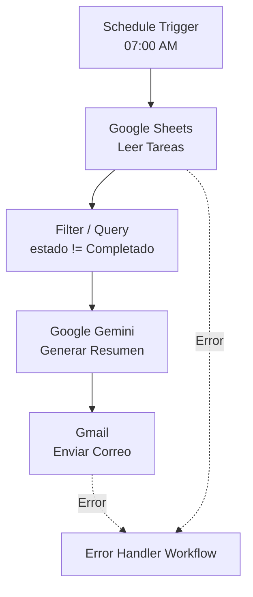

# Task Notifier n8n – Guía Técnica 

Este documento describe la **arquitectura**, **configuración de nodos**, **credenciales**, **gestión de errores** y el **framework de evaluaciones** del workflow de n8n para la automatización de tareas diarias pendientes.

---

## 📖 Arquitectura del Workflow

El flujo principal, denominado `Task Notifier — Daily Summary`, procesa asíncronamente tareas pendientes desde Google Sheets, las consolida y estructura mediante inteligencia artificial, y despacha un correo electrónico resumen a través de Gmail.

---

## ⚙️ Configuración del Flujo y Nodos

* **Nodo de Activación (Schedule Trigger):** 
  * **Cron Expression:** `0 7 * * *` (Se ejecuta diariamente a las 07:00 AM).
  * **Zona Horaria:** `America/Caracas`.

* **Nodo de Extracción (Google Sheets):**
  * **Nombre Recomendado:** `Obtener Tareas`
  * **Operación:** `Read / Get Many`
  * **Archivo:** `Gestion_Tareas_Productividad`
  * **Hoja:** `Tareas_Pendientes`
  * **Credencial:** `googleSheetsOAuth2Api`
  * **Filtro:** Solo se extraen los registros cuyo campo `estado` no sea igual a `"Completado"`.

* **Nodo de Procesamiento IA (Google Gemini):**
  * **Nombre Recomendado:** `Generar Resumen Gemini`
  * **Modelo:** `gemini-1.5-flash`
  * **Credencial:** `googleGeminiApi`
  * **Prompt:** Instruido para consolidar información, generar un resumen ejecutivo asertivo, y estructurar en jerarquía (resaltando prioridades altas).

* **Nodo de Despacho (Gmail):**
  * **Nombre Recomendado:** `Enviar Correo Diario`
  * **Operación:** `Send Email`
  * **Credencial:** `gmailOAuth2`
  * **Asunto Dinámico:** `[Resumen de Tareas] Diarias - {{ $now.format('yyyy-MM-dd') }}` (usando expresiones de n8n).
  * **Formato de Salida:** HTML Semántico (`<h1>`, `<h2>`, `<ul>`, `<ol>`).

---

## 🚨 Gestión Global de Errores (Error Handler)

Para garantizar la idempotencia y la tolerancia a fallos, se han implementado las siguientes políticas:

### Funcionamiento de Reintentos (Nodos de Red)
- Para los nodos que interactúan con APIs externas (Google Sheets y Gmail), se configura:
  - `retryOnFail: true`
  - `maxTries: 3`
  - `waitBetweenTries: 5000` (5 segundos)

### Captura de Errores de Flujo Continuo
- El nodo final de **Gmail** incluye la configuración `onError: "continueErrorOutput"`.
- Se requiere que la salida secundaria (error branch `main[1]`) esté conectada adecuadamente si se necesita lógica intra-flujo.

### Cómo Vincular el Manejador de Errores:
- Se debe crear un flujo de trabajo separado con la convención de nomenclatura: `Task Notifier — Error Handler`.
- **Vínculo Manual:** En la interfaz de usuario del flujo principal (`Task Notifier — Daily Summary`), ir a `Workflow Settings` → `Error Workflow` y seleccionar el flujo de error recién creado.

---

## 🧪 Evaluaciones y Pruebas Continuas (AI Evaluations)

### Estructura de Datos (Dataset de Prueba)
- **Origen**: Google Sheets (`Gestion_Tareas_Productividad` -> `Tareas_Pendientes`).
- **Esquema de las Columnas**:
  - `id` (Integer)
  - `titulo` (String)
  - `descripcion` (String)
  - `fecha_limite` (Date [YYYY-MM-DD])
  - `prioridad` (Enum [Alta, Media, Baja])
  - `estado` (Enum [Pendiente, En Progreso, Completado])
  - `categoria` (String)

### Nodos de Evaluación del Flujo:
- **Pruebas de Carga (Batch Processing):** Los nodos intermedios están diseñados para procesar lotes (batches) de forma eficiente, para evitar estrangulamiento de cuotas de las APIs (Rate Limiting).
- **Testeo Unitario del Workflow:** Previo a la activación, siempre se debe ejecutar un paso de prueba con iteraciones controladas y confirmación del usuario para validar el payload de salida en Gemini y el renderizado final del HTML en el correo electrónico.

---

## 🛡️ Solución de Problemas Comunes

- **Timeout o Rate Limits de las APIs:** Si los nodos fallan repentinamente, verificar que el mecanismo de reintentos (`maxTries`) esté activo. Considerar usar un nodo `Split In Batches` (Loop) si el volumen de tareas en Google Sheets crece exponencialmente.
- **Fallo de Autenticación de Credenciales:** Verificar si los tokens OAuth2 (Sheets, Gmail) o la API Key (Gemini) han caducado en la sección de credenciales nativas de n8n.
- **Formateo Incorrecto de Variables:** Asegurarse de utilizar la sintaxis correcta de expresiones de n8n (`{{ }}`) en caso de errores en la inyección de la fecha actual en el asunto del correo.
